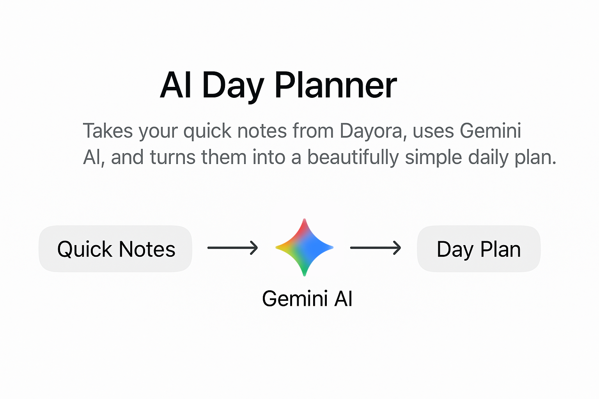

# Dayora

> A lightweight React note-taking app focused on **speed**, **clarity**, and **AI organization**.

👉 **Use Dayora at:** https://dayora.cz




---

## ✨ Features

- **AI Day Planner** turns your quick notes into a personalized daily schedule
- **Clean, distraction-free UI** with folders (Notes, Ideas, Trash) and quick search
- **Pin & delete** notes with one click
- **Dark theme** out of the box
- **Sync & auth** with Firebase (Email & Google sign-in)
- **Tailwind CSS** for fast, consistent styling


<br><br>

## 🧰 Tech Stack

- **React + Vite**
- **Firebase** (Auth + Firestore/Realtime DB)
- **Tailwind CSS**
<br><br>

## 🗂️ Project Structure (example)

```
src/
 ├─ components/      # UI building blocks
 ├─ pages/           # Screens / views
 ├─ lib/             # Firebase & helpers
 ├─ styles/          # Tailwind config / utilities
 └─ main.tsx|jsx     # App entry
```

## 📌 Roadmap

- Tags & filters
- Markdown support
- Drag-and-drop reordering
- Offline mode
- Share/collaboration
<br><br>

## 📄 License
Open source under the **GNU Affero General Public License v3.0 (AGPL-3.0)** — an OSI-approved license. By contributing, you agree to license your contributions under the same license.
