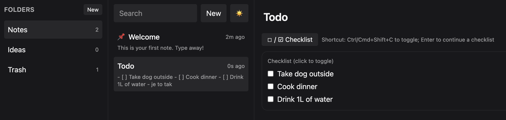
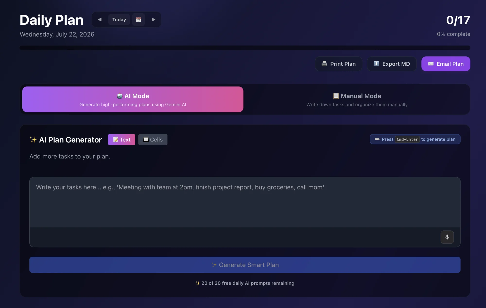
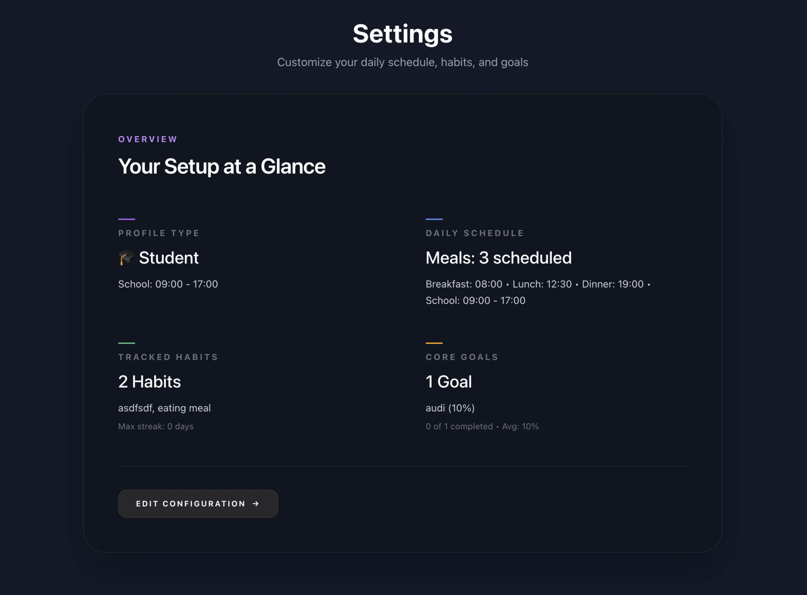

<p align="center">
  
</p>

<h1 align="center">Dayora</h1>
<p align="center"><strong>Write down whatever's in your head. Planning let on us.</strong></p>


<p align="center">
  
</p>

<br>

## What it is

<!-- LAYOUT SECTION 1: Text Left / Image Right -->
<table border="0">
  <tr>
    <!-- Left Column: Text (Vertically Centered) -->
    <td width="40%" align="left" valign="middle">
Most note apps ask you to organize as you write. Dayora doesn't — dump whatever's on your mind into a note, and when you're ready, hand it to Gemini and get back an actual schedule: times, order, meals, habits, all slotted in around what you told it matters to you.
    </td>
    <!-- Right Column: Image and Caption (Large Image) -->
    <td width="60%" align="center">
            
    </td>
  </tr>
</table>

<br> <!-- Spacing -->

<!-- LAYOUT SECTION 2: Text Right / Image Left (Opposite) -->
<table border="0">
  <tr>
    <!-- Left Column: Image and Caption (Large Image) -->
    <td width="60%" align="center">
            
    </td>
    <!-- Right Column: Text (Vertically Centered) -->
    <td width="40%" align="left" valign="middle">
The planning isn't generic, either — Dayora knows your schedule, your habits, and your goals, and folds them into every plan it generates.
    </td>
  </tr>
</table>

<br>

## Features

- **AI Day Planner** — turn a messy brain-dump into a structured schedule with Gemini
- **Manual mode** too, for when you'd rather lay out the day yourself
- **Folders** (Notes, Ideas, Trash), search, pin, and one-click delete
- **Personalization** — schedule, habits, and goals all feed into what the AI plans for you
- **Export & share** a plan as Markdown, print it, or email it to yourself
- **Pro plan** via Stripe for people who want more than the free daily AI quota
- **Installable PWA** — works offline, syncs the moment you're back online
- **Firebase auth** — email or Google sign-in

## Tech stack

- **Next.js 15** + **React 19** + TypeScript
- **Firebase** (Auth + Firestore)
- **Google Gemini API** — plan generation
- **Stripe** — Pro subscriptions and billing portal
- **Resend** — transactional email (plan delivery, account emails)
- **Tailwind CSS**
- Service worker + web manifest for offline/installable PWA support

### Architecture

Everything runs through Next.js route handlers under `src/app/api` — no
separate backend. `generate-plan` calls Gemini server-side with your notes and
profile settings and returns a structured plan; `checkout` and `webhooks/stripe`
handle the Pro upgrade and keep subscription state in sync; `portal` opens
Stripe's customer portal for self-serve billing; `send-email` goes through
Resend. Firestore holds notes and plans, and the service worker caches enough
to keep the app usable offline between syncs.

## Running it locally

```bash
git clone https://github.com/xxKuzi/Dayora.git
cd Dayora
npm install
cp .env.example .env.local   # add your Gemini key, see below
npm run dev
```

Open [localhost:3000](http://localhost:3000).

You'll also need a Firebase project (Auth + Firestore) wired up in `src/`,
plus Stripe and Resend keys if you want to touch the Pro-plan or email paths —
neither is required just to run the note-taking and AI-planning core.

**Required:** `GEMINI_API_KEY` (this powers the Next.js API route — get one at [aistudio.google.com](https://aistudio.google.com/u/2/apikey)).

## License

This repository is shared for portfolio and educational viewing purposes only. You are welcome to clone and execute the project locally to evaluate how it works. However, no permission is granted to modify, redistribute, or incorporate this code into other repositories or software. See [LICENSE](./LICENSE).
